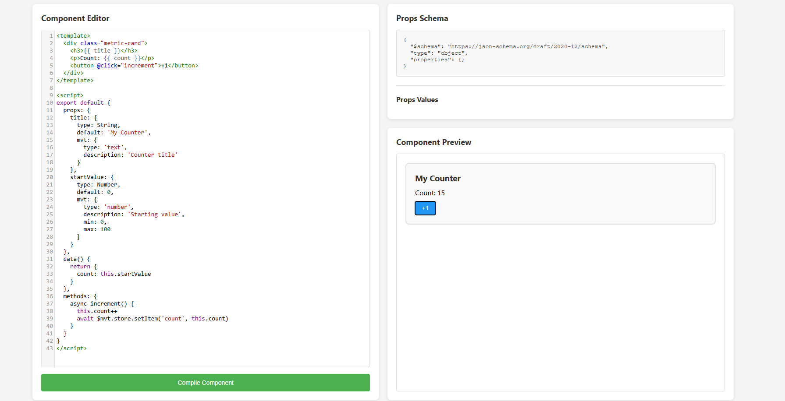

# Code Test: Movement Component System Prototype

Build a standalone prototype that demonstrates the core Movement component system architecture.



## What You're Building

A simple web app that:
1. Lets users write Vue components in a CodeMirror editor
2. Compiles them using WebContainers
3. Extracts props automatically
4. Renders the component with a props UI
5. Provides the $mvt global runtime

## Getting Started

### Prerequisites
- Node.js 18+ installed
- A modern browser (Chrome/Edge recommended for WebContainer support)

### Setup (2 minutes)

```bash
# Install dependencies
npm install

# Start dev server
npm run dev
```

The app will open at `http://localhost:3000`

**Important:** WebContainers require special CORS headers which are configured in `vite.config.js`. The dev server must be running for the app to work properly.

## Your Task

This is a Vue 3 application. Complete the TODOs in the following files:

### `src/App.vue`
1. **TODO 1**: Initialize WebContainer and compile Vue SFC when the user clicks "Compile Component"
2. **TODO 2**: Extract props from the Vue component and convert to JSON Schema format
   - Parse the Vue component's `props` definition
   - Convert Vue types (String, Number) to JSON Schema types (string, number)
   - Extract `default` values and `mvt.description` into the schema
   - Map `mvt.min`/`mvt.max` to `minimum`/`maximum` for number types
   - Return a proper JSON Schema object (see [JSON Schema spec](https://json-schema.org/))
   - The schema will automatically display in the right panel
3. **TODO 4**: Mount the compiled component in the preview panel

### `src/runtime.js`
4. **TODO 5**: Implement the `$mvt.store` methods (localStorage is recommended)

A sample Vue component is provided in the CodeMirror editor to help you get started. It includes props with custom `mvt` metadata that should be extracted. The app structure and reactive data bindings are already set up - you just need to implement the compilation, extraction, and mounting logic.

## Deliverables

1. GitHub repo with your completed solution
2. Update this README with your architectural decisions and any notes

## Time Limit: 24 hours

## Your Notes

### Architectural Decisions & Implementation Approach

#### 1. **$mvt.store Implementation (`src/runtime.js`)**
- Implemented using localStorage with JSON serialization/deserialization
- Both `getItem` and `setItem` are async to match the API contract
- Includes error handling for localStorage operations (e.g., quota exceeded)
- Values are automatically JSON stringified/parsed for complex data types

#### 2. **Props Extraction (`extractProps` function)**
- Uses regex-based parsing to extract props definition from Vue component source
- Parses the script section, then extracts the `props` object
- Handles Vue type conversion (String → string, Number → number, etc.)
- Extracts default values with proper type coercion (string quotes removal, number parsing)
- Extracts `mvt` metadata including:
  - `description` → JSON Schema `description`
  - `min`/`max` → JSON Schema `minimum`/`maximum` for number types
- Returns a valid JSON Schema object compatible with the draft 2020-12 specification

#### 3. **WebContainer-Based Compilation**
- **Initialization**: Creates a minimal Node.js environment in WebContainer with `package.json` and installs `@vue/compiler-sfc`
- **Compilation Process**:
  1. Writes the Vue SFC source to the container filesystem
  2. Creates a Node.js compilation script that uses `@vue/compiler-sfc` to:
     - Parse the SFC into descriptor (template, script, styles)
     - Compile the script section
     - Compile the template section into a render function
     - Output both as JSON for easy transport back to the browser
  3. Executes the compilation script and captures output
- **Output Format**: Returns structured object with `script`, `render`, and metadata

#### 4. **Component Mounting**
- **Execution Strategy**: Uses `Function` constructor to safely execute compiled code in browser context
- **Vue API Injection**: Injects Vue 3 APIs (ref, computed, watch, onMounted, onUnmounted) into the execution context
- **Component Assembly**: 
  - Executes compiled script code to get component options (`__sfc__`)
  - Wraps compiled render function
  - Combines into a complete Vue component definition
- **Props Handling**: Passes current prop values as props when mounting the component
- **Error Handling**: Gracefully handles compilation errors and displays user-friendly error messages

#### 5. **Reactive Prop Updates**
- Watches `propValues` for changes after initial compilation
- Reuses the last compiled component definition (avoids recompilation on prop changes)
- Unmounts and remounts component with new prop values for simplicity and reliability
- Only triggers updates after component is initially mounted

### Technical Challenges & Solutions

1. **Browser Execution of Compiled Code**: 
   - Challenge: Compiled Vue code expects Node.js module system
   - Solution: Use `Function` constructor with injected Vue APIs, strip import statements

2. **Prop Value Type Coercion**:
   - Challenge: Default values in component source are JavaScript expressions
   - Solution: Pattern matching with type-aware parsing (string unquoting, number parsing)

3. **WebContainer Integration**:
   - Challenge: Setting up Node.js environment and dependency management
   - Solution: Create minimal `package.json` and use npm install in container

4. **Component Remounting**:
   - Challenge: Updating props without losing component state
   - Solution: Store compiled component definition and remount with new props (simple and reliable)

### Known Limitations

- Component state is lost when props change (component is remounted)
- WebContainer initialization takes time on first use (dependencies must be installed)
- Complex default values (functions, objects) may not parse correctly from string source
- Only supports Vue 3 Options API components (not Composition API with `<script setup>`)

### Future Improvements

- Cache compiled components to avoid recompilation
- Support for `<script setup>` syntax
- Better error messages and compilation feedback
- Hot-reload on source changes
- Preserve component state during prop updates


